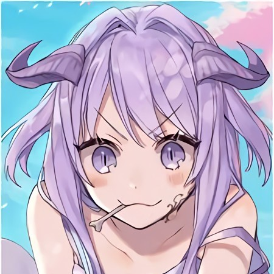

	

	
	
	
	
	

	
	
	
	

# XBOT
Powerfull Bot Builded With TypeScript

## Instalation
- change default login [number](https://github.com/ItzNgga/xbot/blob/master/index.ts#L491)
- use `tsc` to compile the project

## Usage
- `sh start.sh` normal start
- `sh pm2.sh` pm2 runtime start
- `sh nodemon.sh` nodemon runtime start

## Config
change your default raw [config file](https://github.com/ItzNgga/xbot/blob/master/json/raw/config.json)

## Requirements
- Android/Termux currently not supported
- Waifu2x Cpp Binary *(optional)*
- TensorFlow Cpu support *(optional)*
- Python Speech Recognition package *(optional)*
- ImageMagic/GraphicsMagic support
- FFMPEG support
## Main Features
- Lewd picture detector
- Anime Picture Optimizer
- Harta Tahta ImageMagic
- Speech To Text (en-US/id-ID)
- Simple TicTacToe game
- Simple Genshin Impact wishing system
- Convert to 8D Audio
- AntiBUG Obj detection
- and many more...

## License
[MIT](https://github.com/ItzNgga/xbot/blob/master/LICENSE)